<p align="center">
  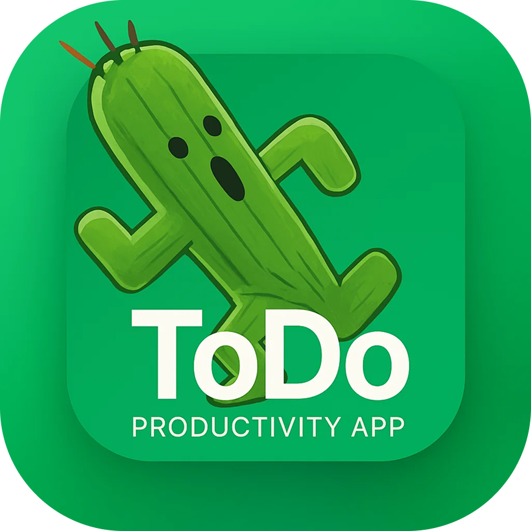
</p>

<h1 align="center">Typicode Todo</h1>

<p align="center">
  This project fetches and displays a list of TODO items from the <a href="https://jsonplaceholder.typicode.com/todos" target="_blank">JSONPlaceholder API</a>.
</p>

---

**📝 Summary**
`The project compiles and runs, but originally had incomplete parts that needed further implementation. I expanded it into a realistic production-ready example app.`

**🎯 Goal**
`Showcase how a real-life, complex, scalable and production-ready app could be built
with a very minimal scopes of requirements`

---

## 📸 Screenshots

<p align="center">
  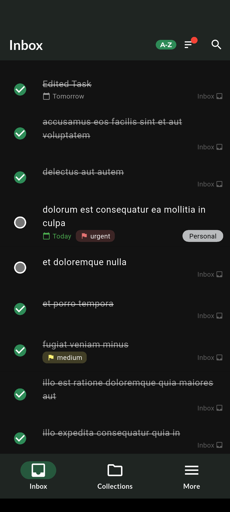
  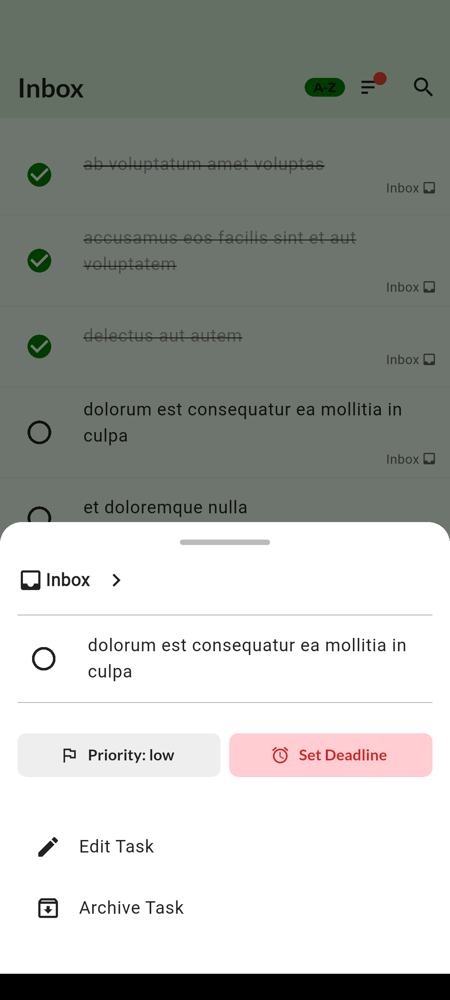
  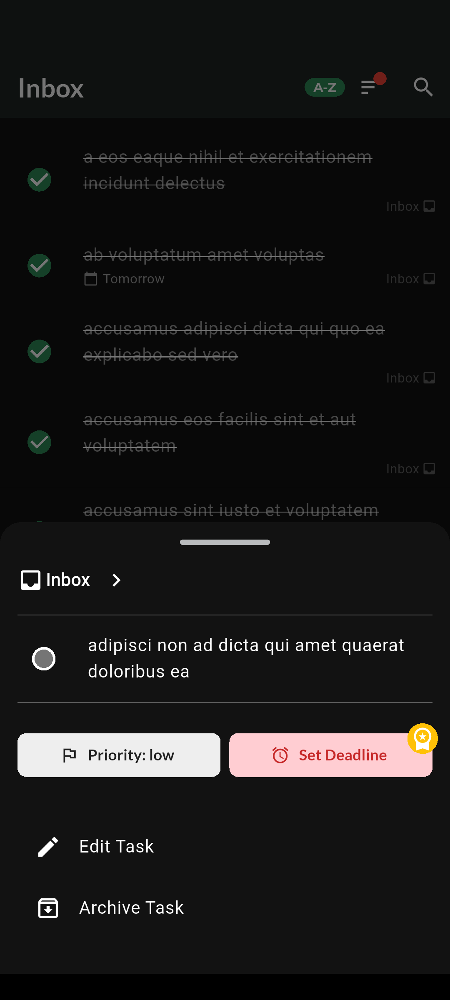
</p>

<p align="center">
  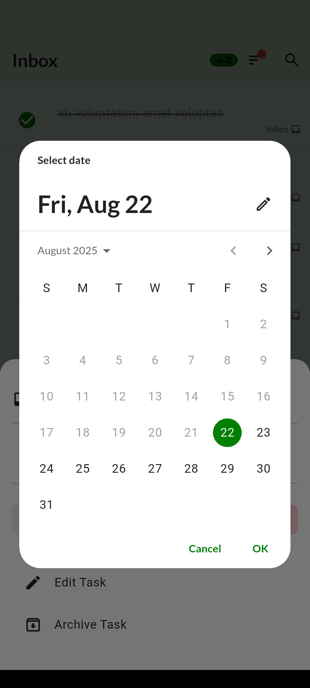
  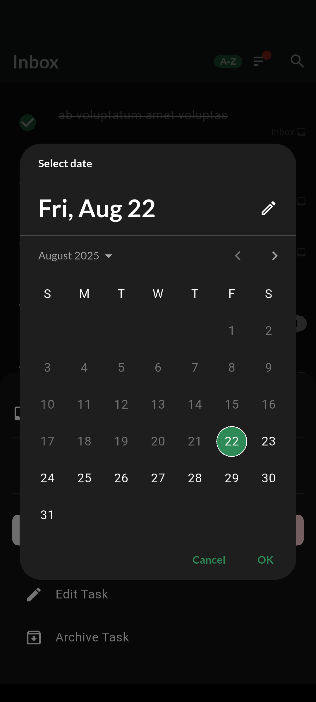
  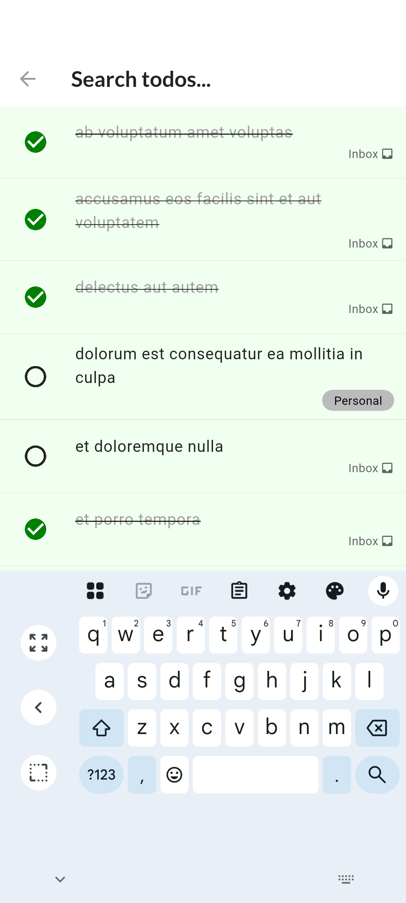
</p>

<p align="center">
  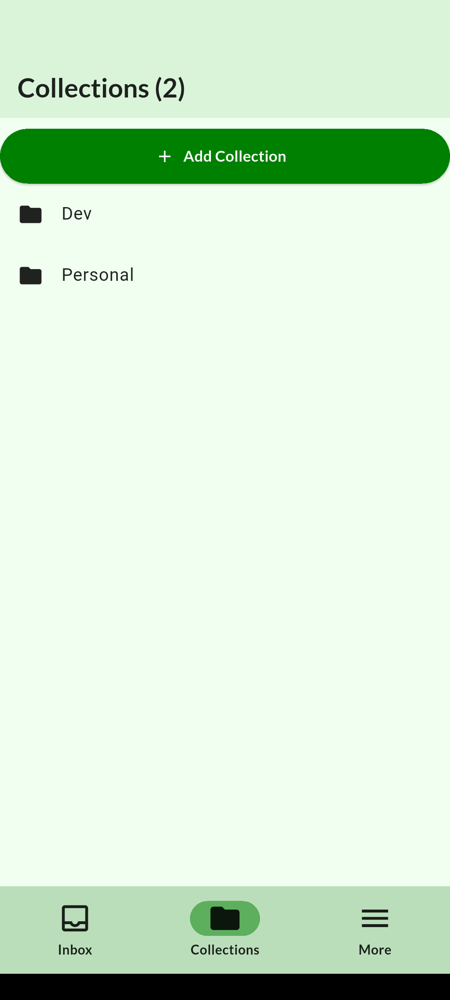
  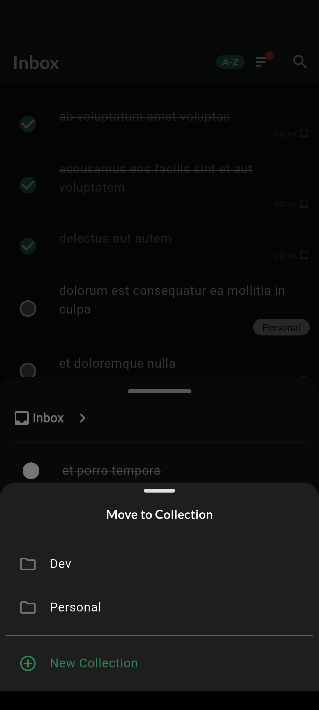
  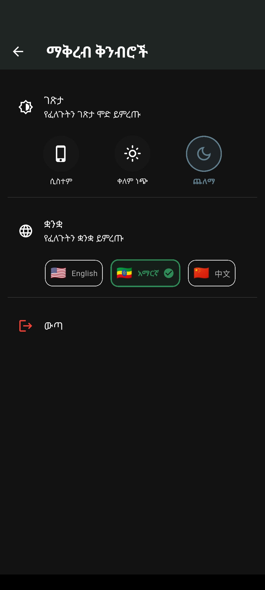
</p>

<p align="center">
  
  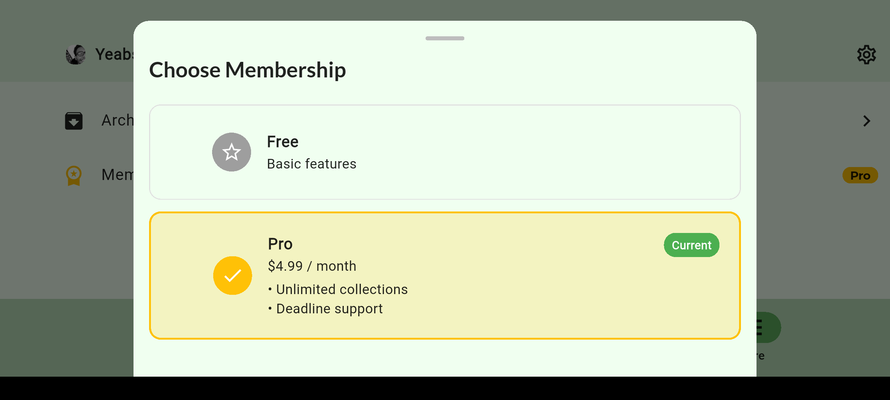
</p>

<p align="center">
  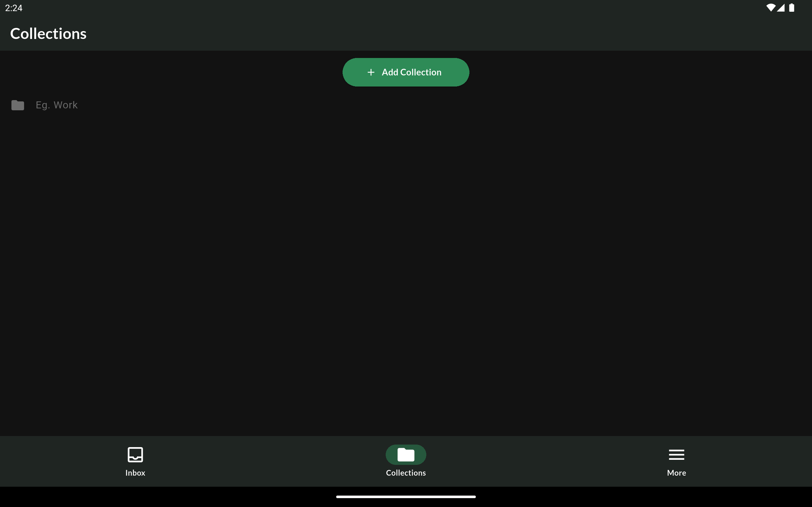
  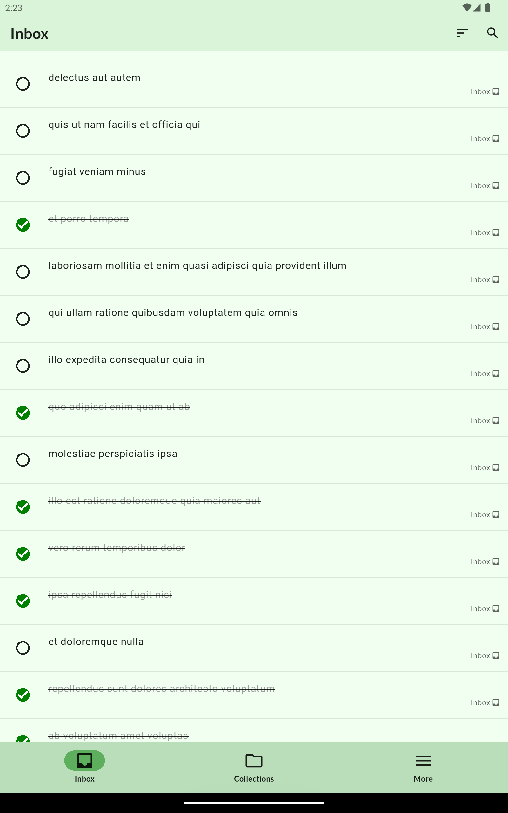
  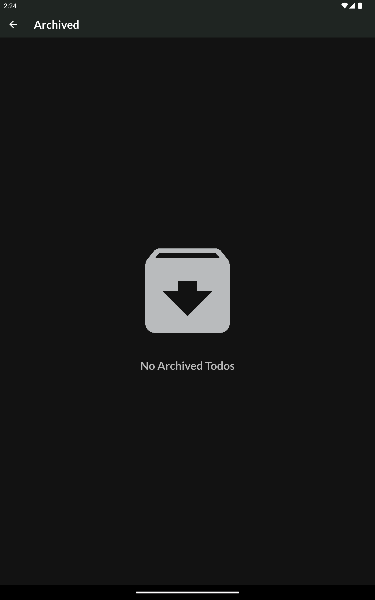
</p>

## ✨ Implemented Features

### 🔹 Original Requirements

- ✅ **API Integration**: Fetch todos from JSONPlaceholder API
- ✅ **State Management**: GetX for controller & state management
- ✅ **UI Logic**: Connected existing UI components to real data
- ✅ **Refresh Functionality**: Reload data using a floating action button
- ✅ **Error Handling**: Show loading states and error messages

### 🔹 Additional Features

- ✅ **CRUD Implementation** (Create, Read, Update, Delete)
- ✅ **Search, Filter & Categorization of Todos**
- ✅ **Caching** for optimized performance & smooth UX
- ✅ **Paywall Sample Implementation**
- ✅ **Localization Support**
- ✅ **Consistent Theme Management**
- ✅ **Action Sounds** for better UX
- ✅ **Responsive Design** for different screens
- ✅ **Custom App Icon** (designed in Figma)
- ...and **many more enhancements** 🎉

---

## Setup

1. Install dependencies: `flutter pub get`
2. Run the project: `flutter run`

## Build Local Testing

```
flutter build apk \
  --release \
  --obfuscate \
  --split-debug-info=build/symbols

```

## 🤝 Contributions

If you’d like to contribute:  
Please first read the [CONTRIBUTING.md](CONTRIBUTING.md) guide.

---
