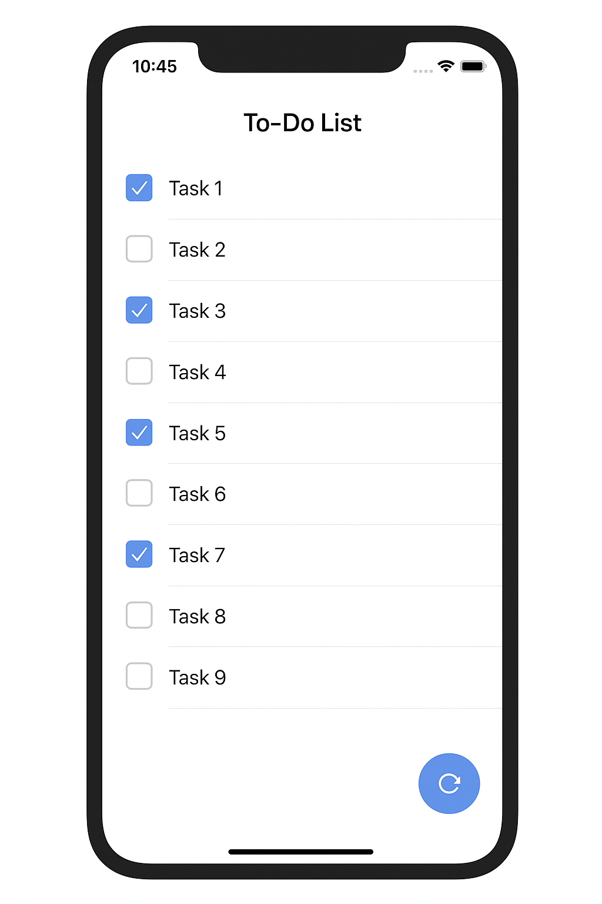

# Todo Test Task

A Flutter test task for candidates to demonstrate their skills in API integration, state management, and UI implementation.

## Task Overview

Fetch and display a list of todos from the [JSONPlaceholder API](https://jsonplaceholder.typicode.com/todos). The project compiles and runs but has incomplete parts that need implementation.

## Sample UI



## Features to Implement

- **API Integration**: Fetch todos from JSONPlaceholder API
- **State Management**: Use GetX for controller and state management
- **UI Logic**: Connect existing UI components to real Data
- **Refresh Functionality**: Reload data using floating action button
- **Error Handling**: Show loading states and error messages

## Project Structure

```
lib/
 ├─ main.dart                 # App entry point
 ├─ models/todo.dart          # Todo data model
 ├─ services/api_service.dart # API service (incomplete)
 ├─ controllers/todo_controller.dart # GetX controller (incomplete)
 └─ views/home_page.dart      # Main UI (incomplete)
```

## Setup

1. Install dependencies: `flutter pub get`
2. Run the project: `flutter run`

## TODO Items

### 1. API Service (`lib/services/api_service.dart`)

- Implement `fetchTodos()` method to fetch from `https://jsonplaceholder.typicode.com/todos`

### 2. Todo Controller (`lib/controllers/todo_controller.dart`)

- Complete `loadTodos()` method with loading states and error handling
- Implement `toggleTodoCompletion(int id)` method
- Initialize data loading in `onInit()`

### 3. UI (`lib/views/home_page.dart`)

- Replace static data with real data from controller
- Connect checkbox functionality
- Implement refresh and retry buttons

## API Endpoint

- **URL**: `https://jsonplaceholder.typicode.com/todos`
- **Method**: GET
- **Response**: Array of todo objects with `id`, `title`, and `completed` fields

## Submission

1. Complete the implementation
2. Take a screenshot of your working app
3. Create a pull request with your name in the format: **"First Last - Todo Test Task"**
4. Include the screenshot in your PR description
5. Ensure the app loads todos, allows completion toggling, and handles refresh/errors

## Dependencies

- `get: ^4.6.5` - State management
- `http: ^1.1.0` - HTTP requests

Good luck! 🚀
